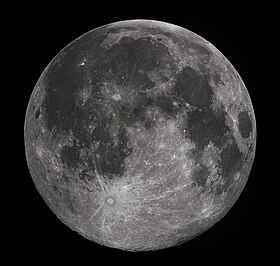

# lune

La lune est un satellite de la Terre.

Icone créée par [wikipedia](https://fr.wikipedia.org/wiki/Lune) trouvée sur [wikipedia](https://fr.wikipedia.org/wiki/Lune).

## Caractéristiques

- Masse : 7.36 x 1022 kg
- Diamètre : 3474.8> km
- Symbole : &#x1F315;
