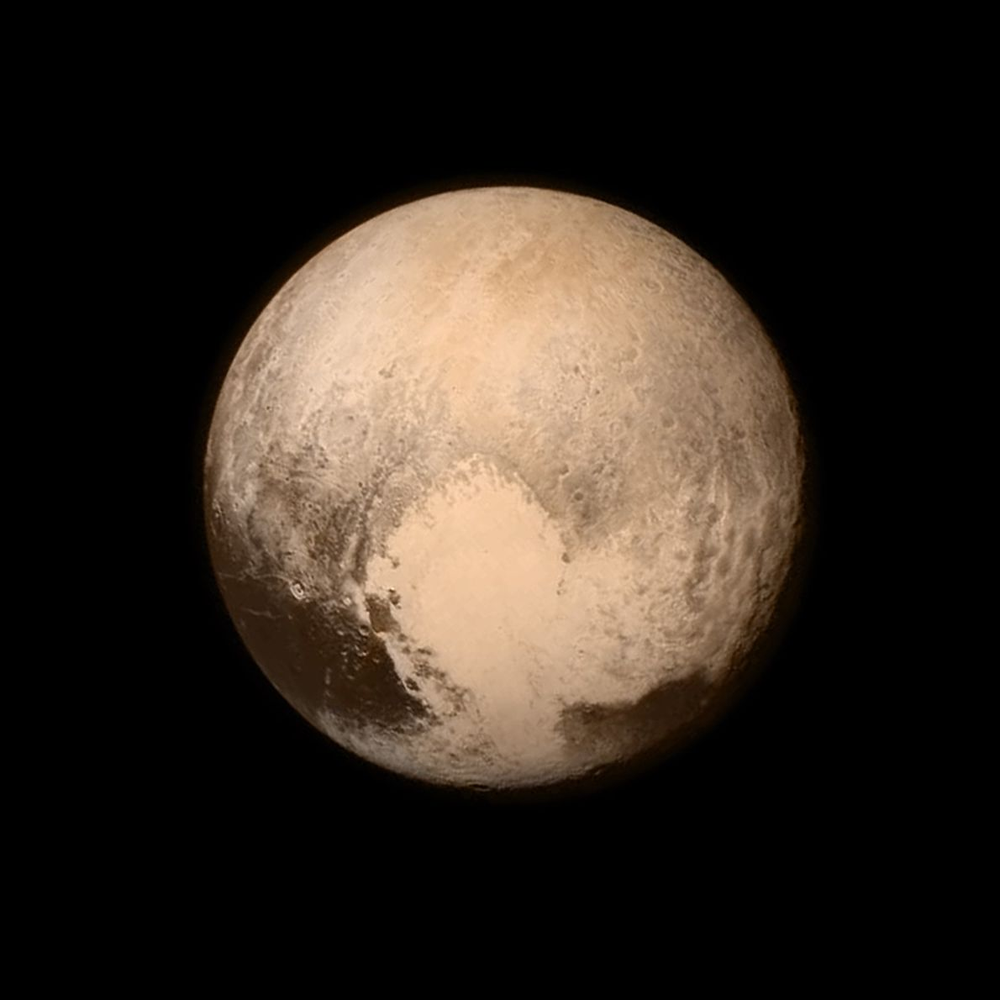

# Pluton

Pluton est une planète du système solaire.

Icone créée par [nationalgeo](https://www.nationalgeographic.fr/photography/2019/12/nos-plus-belles-photos-de-pluton) trouvée sur [nationalgeo](https://www.nationalgeographic.fr/photography/2019/12/nos-plus-belles-photos-de-pluton).

## Caractéristiques

- Masse : 1.3 x 1022 kg
- Diamètre : 2376.6 km
- Symbole : &#x2647;
