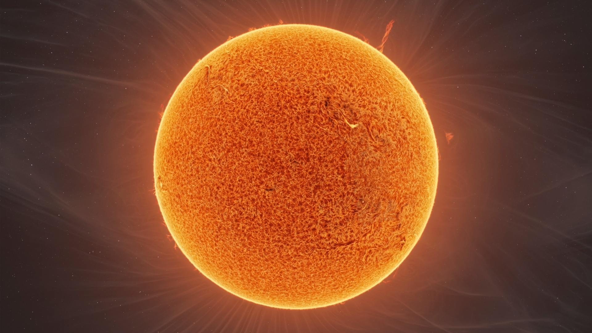

# Soleil

Le soleil est l'étoile du système solaire.

Icone créée par [Wilfried(https://www.numerama.com/author/wilfried-apithi/) trouvée sur [numerama](https://www.numerama.com/sciences/1315334-cette-photo-du-soleil-dune-rare-precision-combine-90-000-images.html).

## Caractéristiques

- Masse : 1.9891 x 1030 kg
- Diamètre : 1.3927 x 106 km
- Symbole : &#x2609;;
